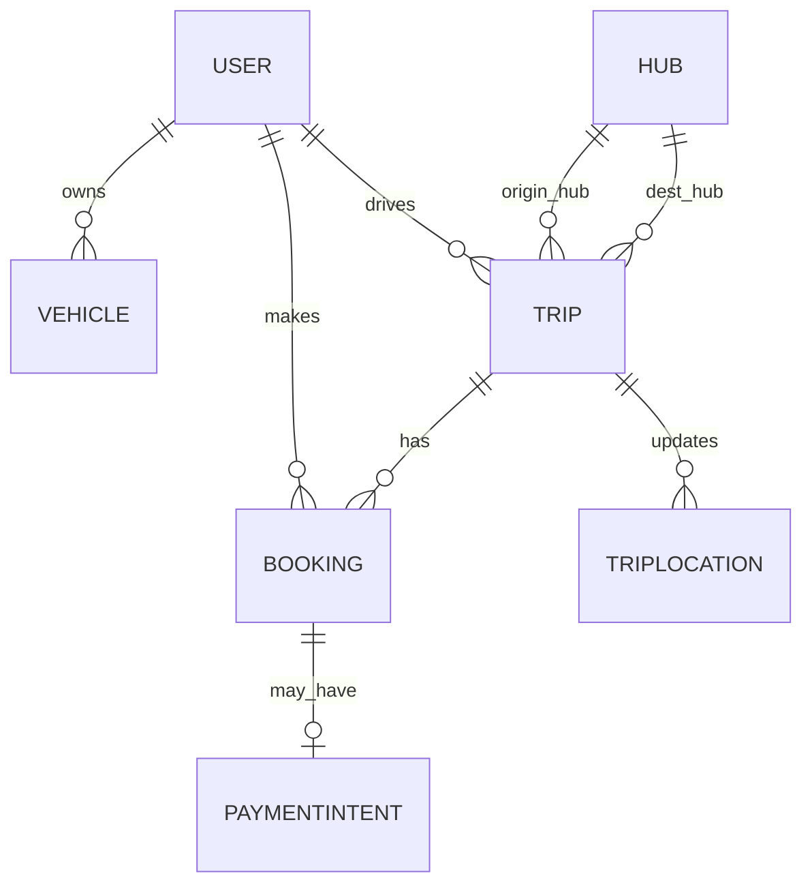

# Campus Relay

A lightweight campus ride-sharing platform (Rider ↔ Driver) built with **React + TypeScript** and **Express + MongoDB**. Secure, cookie‑based auth, seat‑based bookings, optional UPI payment intent, and live trip location trails.

> **Live demo:**
>
> * **Frontend:** [https://campus-relay-1.onrender.com](https://campus-relay-1.onrender.com)
> * **Backend API:** [https://campus-relay.onrender.com/api](https://campus-relay.onrender.com/api)

---

## 1) Problem → Solution

**Problem.** Students and staff need reliable campus‑to‑city transport. Ad‑hoc chats and spreadsheets don’t scale—no seat visibility, no pickup coordination, and drivers can’t broadcast routes easily.

**Solution.** Campus Relay lets any verified driver publish trips (carpool/shuttle), riders search and book seats with OTP verification at pickup, and everyone track progress live. It’s optimized for low overhead: simple stack, fast UI, and deploys to Render in minutes.

---

## 2) Highlights

* 🔐 **Auth**: HTTP‑only cookies (access + rotating refresh), CORS with credentials.
* 🧭 **Rider**: search trips, view details, book seats, QR/UPI payment intent, see bookings.
* 🚗 **Driver**: add vehicles, create/manage trips, start/complete, verify rider OTP, live trail.
* 🗺️ **Live Location**: driver posts GPS points; viewer sees trail (Leaflet polyline).
* ⚙️ **DX**: React + Vite + TanStack Query, Express + Mongoose, TypeScript end‑to‑end.

---

## 3) Screenshots

> Put images in `./screenshots/` or use GitHub asset links.  
> Use **either** Markdown image syntax **or** HTML `` (not both together).

### Hosted (GitHub asset) examples


## 4) Architecture


### ER Diagram



---

## 5) Tech Stack

**Frontend.** React 18/19 + TypeScript, Vite, Tailwind, shadcn/ui, TanStack Query, React Router, Leaflet.

**Backend.** Node 18+ (works on 22), Express + TypeScript, Mongoose, bcrypt, jsonwebtoken, zod.

**Infra.** Render (Static Site + Web Service), MongoDB Atlas.

---

## 6) Project Structure

```
frontend/
  client/                 # React app
    src/
      components/
      features/          # trips, bookings, vehicles, location
      lib/               # axios instance, auth helpers
      pages/             # Login, Register, Dashboard
      styles/
    vite.config.ts
    tsconfig*.json

backend/
  src/
    controllers/
    middlewares/
    models/
    routes/
    utils/
    app.ts
    index.ts
  tsconfig.build.json
```

---

## 7) Environment Variables

### Backend (`backend/.env`)

```env
# Mongo
MONGODB_URI=mongodb+srv://<user>:<pass>@cluster.../campus_relay
DB_NAME=campus_relay

# JWT
JWT_ACCESS_SECRET=your_access_secret
JWT_REFRESH_SECRET=your_refresh_secret
ACCESS_TOKEN_TTL=15m
REFRESH_TOKEN_TTL=7d

# CORS + Cookies
FRONTEND_URL=https://campus-relay-1.onrender.com
PUBLIC_ORIGIN=https://campus-relay.onrender.com  # your backend public URL
# COOKIE_DOMAIN=yourdomain.tld                    # leave empty on Render/on localhost
# COOKIE_INSECURE=true                            # for local http only

# Port
PORT=8080
```

### Frontend (`frontend/client/.env`)

```env
VITE_API_BASE=https://campus-relay.onrender.com/api
```

---

## 8) Run Locally

### 1) Backend

```bash
cd backend
cp .env.example .env   # or create using the block above
npm install
npm run build
npm run serve          # or: NODE_ENV=production node dist/index.js
```

The server should print: `Server is running at :8080` and Mongo connected.

### 2) Frontend

```bash
cd frontend/client
npm install
npm run dev            # http://localhost:5173
```

If your backend runs locally, set `VITE_API_BASE=http://localhost:8080/api`.

---

## 9) Deploy on Render

### Backend (Web Service)

* **Root Directory**: `backend`
* **Build Command**: `npm ci --include=dev && npm run build`
* **Start Command**: `node dist/index.js`
* **Environment**: add all Backend env vars above.

### Frontend (Static Site)

* **Root Directory**: `frontend/client`
* **Build Command**: `npm ci --include=dev && npm run build`
* **Publish Directory**: `dist`
* **Redirects/Rewrites** (proxy API):

  * Source: `/api/*`  → Destination: `https://<your-backend-host>/api/:splat`  → Action: **Rewrite**

> Ensure both front and back are **HTTPS**; cookies are Secure+SameSite=None in prod.

---

## 10) Usage Walkthrough

* **Register/Login** → cookies set (HTTP‑only).
* **Rider**: *Find Trips* → *Trip Detail* → *Book* → *Payment QR* → see in *My Bookings*.
* **Driver**: *Vehicles* → *Create Trip* → *Start* → *Driver Live*; verify OTP at pickup.
* **Live Trail**: viewers open `/live/:tripId` to watch movement.

> To become a driver, use **Driver → Join** in the UI (upgrades role) or update in DB.

---

## 11) API Glance

* `POST /api/auth/register`, `POST /api/auth/login`, `GET /api/auth/me`, `POST /api/auth/refresh`, `POST /api/auth/logout`
* `GET /api/trips/search`, `GET /api/trips/:id`, `POST /api/trips` (driver), status actions
* `POST /api/bookings`, `GET /api/bookings/my`, `GET /api/bookings/:id`, `POST /api/bookings/:id/otp`
* `POST /api/payments/intent`, `GET /api/payments/:id/qr.png`
* `POST /api/locations/:tripId`, `GET /api/locations/:tripId`

---

## 12) Security Notes

* Access token (short‑lived) + Refresh token (rotated) in **HTTP‑only cookies**.
* CORS allowlist via `FRONTEND_URL`, `withCredentials: true` on Axios.
* Refresh token hashes stored server‑side; revoke on logout/rotate.

---

## 13) Roadmap

* Email/OTP auth option; push notifications; fare splitting; admin dashboards; geo‑queries with 2dsphere; better payment flows.

---

## 14) License

MIT © 2025 Ayush
